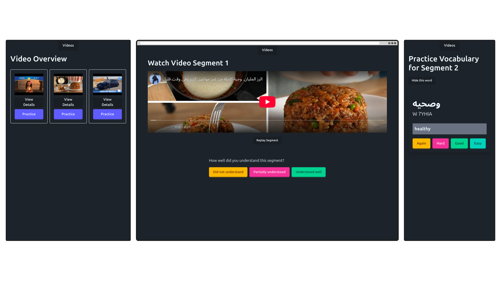

# Vary Video Vocab

- learn the vocab to understand a video, watch the video, repeat

## Adding more videos

1. get the youtube id and put as a line in `scripts/data/ids.txt`
    1. and in `new_ids`, only the new ones 
2. run `scripts/4` and `5`
3. Paste `video_transcripts.json` and `words.json` to `src/assets/videos.json` and `src/assets/words.json`

## Dev Log

- this project was started _before_ the Django version, but became the main version of the project after concluding the test launch of the Django version