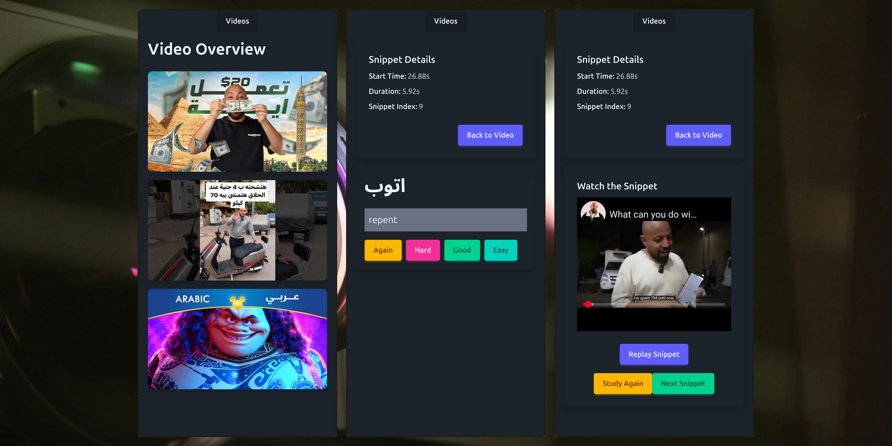

# Vary Video Vocab

- learn the vocab to understand a video, watch the video, repeat
- my latest attempt, for spoken Arabic :)

## Understand & Develop

- basic vue app; run with `npm i`, `npm run dev`

### Data

### Folders

### Testing

## Notes

- this project was started _before_ the Django version, but became the main version of the project after concluding the test launch of the Django version