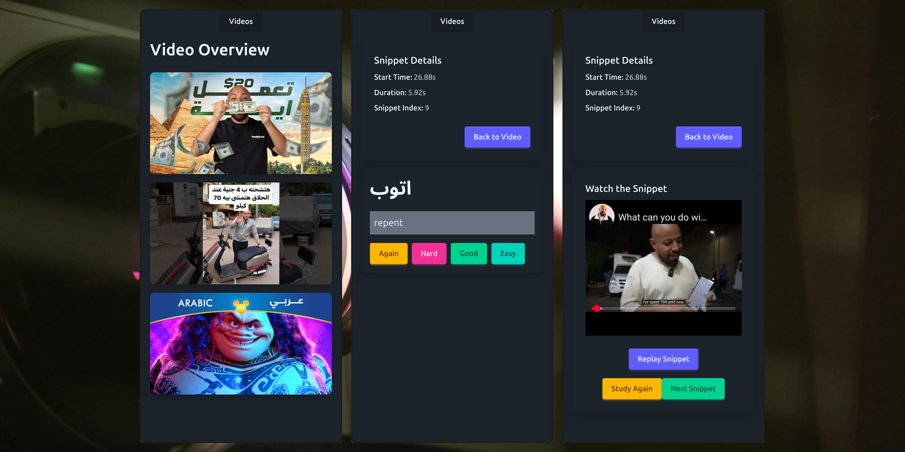

- *learn the vocab to understand a video, watch the video, repeat*
- my latest attempt, for spoken Arabic :)


## User Stories

### ١

**As a learner, I want to watch and understand interesting Arabic videos from day 1**


- [ ] a range of interesting videos is included

### ٢

**As a learner, I want to learn to communicate in Arabic**


- [ ] app covers relevant topics, expressions, words and grammar

### ٣

**As a learner, I want to integrate the app into my long-term Arabic study routine**


- [ ] accounts exist; progress can be synced across devices
- [ ] progress is tracked

### ٤

**As a learner, I do not want to be bored or frustrated**


- [ ] app includes appropriate gamification/extrinsic motivation to keep going
- [ ] features should not feel boring


## Understand & Develop

- basic vue app; run with `npm i`, `npm run dev`

### Data

Understand the following about data sourcing in this project:

- this app dances around _two_ data sources:
  1. `JSON`-based, **static**, read-only data stored in `public/data`
  2. **dynamic**, per-learner learning data, to be managed in `supabase`
- here are a few examples and use cases describing the two types of data:
  - to get all videos we have, we poll the static `videos.json`
  - to get all snippets in a video, we poll the static file `public/data/out/$youtube_id.json` that exists for every video
  - to get all words that need to be learned to understand a snippet, we poll the relevant part of `public/data/out/$youtube_id.json`
  - to get all the flashcards that a learner currently has to learn, we ask only the dynamic data
  - to get all flashcards that are currently due for a learner within in the context of a specific snippet, we first use the static data, then compare against the dynamic data

  In the future, it may be wise to move all into supabase, but for now this makes it nice and easy to get started :)


### Folders

The project follows a module-based architecture. That means that instead of putting all composables into `composables/`, things are structured by domain-informed features. Things should be mostly contained into their folder, and communicate outside their system boundaries in clearly defined ways

```bash
├── App.vue                                       # boilerplate
├── main.css                                      # should not be extended; use tailwind + Daisy
├── modules                                       # everything's a module!
│   ├── spacedRepetitionLearning                  # fsrs stuff, reading the local data, talking to the per-user data on supabase
│   │   ├── api.ts                                # the only file of the folder talking to the rest of the code
│   │   ├── exposeStaticPerVideoData.ts           # accessing the per-video jsons, out/$youtube_id.json
│   │   └── exposeVideoList.ts                    # accessing videos.json
│   ├── viewFlashcard                             # a reusable flashcard(s) viewer
│   │   ├── FlashCardsWrapper.vue                 # get n flashcards, make sure we go through all
│   │   └── FlashCard.vue                         # show a single flashcard to the learner, let them reveal and rate the content
│   ├── viewSnippet                               # learner wants to watch and eval a snippet of a video
│   │   ├── SnippetView.vue                       # shows first a flashcard renderer for the snippet, then afterwards lets learner watch and eval by loading WatchSnippet
│   │   └── WatchSnippet.vue                      #
│   ├── viewVideo                                 # viewing stuff relating to a video as a whole
│   │   ├── components                            #
│   │   │   └── VideoCard.vue                     #
│   │   └── VideoView.vue                         #
│   └── viewVideoList                             # see all the videos that we got
│       └── VideoListView.vue                     #
├── router.ts                                     # we're not doing much routing, so we're keeping that here
├── shared                                        # stuff that's used across the app
│   └── types                                     #
│       └── domainTypes.ts                        # types (=interfaces) like Flashcard
```


### Testing

### Adding Content

- Helpful: [youtube short with subtitle search](https://www.youtube.com/results?search_query=+%D8%A7%D9%84%D9%82%D8%A7%D9%87%D8%B1%D8%A9&sp=EgQYASgB)

- add video as an object into `public/data/videos.json`
- make a `venv` at project root and activate it
- install reqs: `pip install -r requirements.txt`
- run: `python generate_data.py`

## Notes

- this project was started _before_ the Django version, but became the main version of the project after concluding the test launch of the Django version