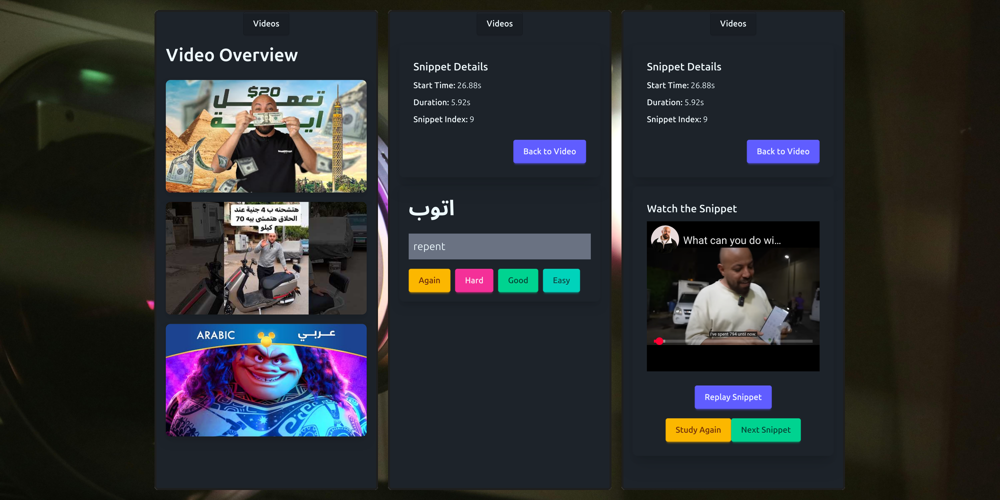
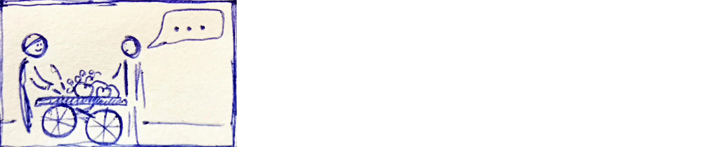

- *learn the vocab to understand a video, watch the video, repeat*
- originally built for spoken Arabic; now structured as per-course language folders

*Archived Project. The best ideas from it will live on in [linguanodon](https://github.com/koljapluemer/linguanodon).*

## User Stories

### ١

**As a learner, I want to watch and understand interesting target-language videos from day 1**


- [ ] a range of interesting videos is included

### ٢

**As a learner, I want to learn to communicate in my target language**



- [ ] app covers relevant topics, expressions, words and grammar

### ٣

**As a learner, I want to integrate the app into my long-term study routine**


- [ ] accounts exist; progress can be synced across devices
- [ ] progress is tracked

### ٤

**As a learner, I do not want to be bored or frustrated**


- [ ] app includes appropriate gamification/extrinsic motivation to keep going
- [ ] features should not feel boring

## Understand & Develop

- frontend: `npm i`, `npm run dev`
- python tooling: `cd crm`, then `uv run crm --help`

## Features

- [Learning the Flashcards of a Video Snippet](doc/features/practicing_vocab_of_snippet.md)

### Data

The project uses two data sources:

1. Static, read-only course data in `public/data`
2. Dynamic, per-learner data to be managed in Supabase

Current static structure:

```text
public/data/
  index.json
  arz/
    course.json
    videos/
  deu/
    course.json
    videos/
  ita/
    course.json
    videos/
```

- `public/data/index.json` lists available course codes
- `public/data/<iso3>/course.json` is the source of truth for one course
- `public/data/<iso3>/videos/<youtube_id>.json` stores generated snippet/word data
- `public/data/<iso3>/subtitles/` is used by subtitle extraction tooling
- non-public discovery/work files live under `crm/data/work`

### Folders

The project follows a module-based architecture. Most frontend code is organized by feature domain.

```bash
├── crm                                          # uv project for course/data tooling
├── public/data                                  # static per-course app data
├── src/modules                                  # frontend modules by feature
├── src/router.ts                                # course-scoped routes
└── src/shared/types                             # shared frontend types
```

### Adding Content

- add or edit a course in `public/data/<iso3>/course.json`
- run `cd crm && uv run crm generate-data --course <iso3>`
- optionally run `cd crm && uv run crm extract-subtitles --course <iso3>`

For legacy repos still on the old layout, run:

- `cd crm && uv run crm migrate-legacy-data`

## Notes

- this project was started before the Django version, but became the main version after the Django test launch
