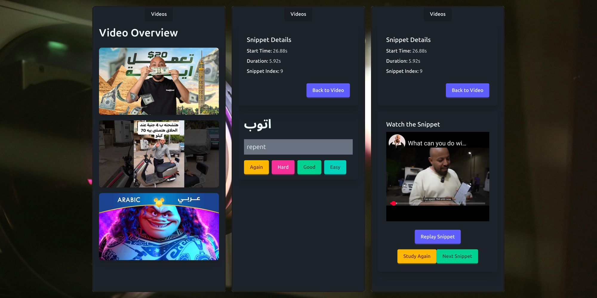

# Video Vocab

Single-view context practice for short target-language clips.

## Adding Content

- add or edit a course in `public/data/<iso3>/course.json`
- run `cd crm && uv run crm generate-data --course <iso3>`
- optionally run `cd crm && uv run crm extract-subtitles --course <iso3>`

For legacy repos still on the old layout, run:

- `cd crm && uv run crm migrate-legacy-data`
